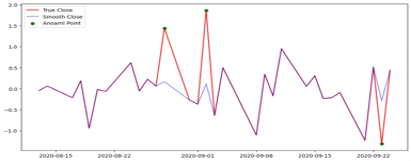
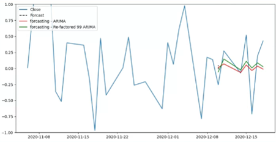

# ARIMA 모델의 충격 완화 접근법 (Shock Relaxed Approaches With Refactored ARIMA Model)

**UNIST 2023년 Fall Semester**
시계열 분석 (FIA52301) 기말 그룹 프로젝트 (12조)

**Authors:**
* Daehyuk Bu
* **Jae Yeon Park**
* Song Kim
* Taehoon Kim

---

## 1. 🎯 프로젝트 동기 (Motivation)

금융 시장은 복잡하며 다양한 거시적, 미시적 요인으로 인해 예측이 어렵습니다. 특히, 경제 위기나 팬데믹 같은 갑작스러운 **'충격(Shock)'**은 주가를 예측 불가능하게 만듭니다.

전통적인 시계열 모델인 **ARIMA**는 이러한 충격(이상치)에 매우 민감하게 반응하여 예측의 안정성이 떨어지는 한계가 있습니다.

본 프로젝트의 목표는 딥러닝(VAE)을 활용해 이러한 충격을 식별하고 데이터를 '평활화(Smoothing)'함으로써, **ARIMA 모델의 예측 안정성을 보완하고 강화**하는 것입니다.

## 2. 💡 방법론 (Methodology)

본 프로젝트는 3단계의 접근법을 사용합니다.

### 1단계: VAE를 이용한 이상치(Shock) 탐지
* **모델**: LSTM 기반의 **VAE (Variational Autoencoder)**를 사용하여 시계열 데이터(Coca-Cola 주가)를 학습시킵니다.
* **탐지**: VAE가 원본 데이터를 얼마나 잘 복원했는지를 나타내는 '복원 오차(Reconstruction Error)'를 계산합니다.
* **기준**: 복원 오차가 **상위 1% (99th percentile)를 초과**하는 지점을 '이상치(Anomaly)'로 정의합니다.

### 2단계: DBSCAN을 이용한 교차 검증
* VAE가 탐지한 이상치들의 신뢰도를 높이기 위해, 밀도 기반 클러스터링 알고리즘인 **DBSCAN**을 사용하여 교차 검증을 수행했습니다.
* 두 방법론 간에 탐지된 이상치 지점이 시각적으로 **상당 부분 겹치는 것**을 확인하여 VAE 모델의 유효성을 확보했습니다.

### 3단계: 이상치 평활화 (Smoothing) 및 ARIMA 리팩토링
* **핵심 아이디어**: 탐지된 이상치를 제거하는 대신, VAE가 학습한 데이터의 분포를 활용해 '완화'시킵니다.
* **방식**: 이상치로 탐지된 날의 실제 주가(True Close)를 VAE가 예측한 **'평균(mean) + 3*표준편차(sigma)'** 값으로 대체합니다.
* **최종 예측**: 이 '평활화된' 시계열 데이터를 **ARIMA 모델**에 다시 적용하여 미래를 예측합니다.

*(리포트 Figure 6: VAE를 통한 이상치 평활화 예시)*

## 3. 📊 실험 결과 (Results)

Coca-Cola (KO) 주식의 2000년부터 2020년까지 데이터를 사용했습니다.

'평활화'를 적용한 모델(Ref 99)이 순수 ARIMA 모델(Naïve Model)보다 모든 평가지표(MAE, MSE, RMSE)에서 더 우수한 예측 성능을 보였습니다.

| Model | MAE | MSE | RMSE | MPE |
| :--- | :---: | :---: | :---: | :---: |
| Naïve Model | 0.317 | 0.144 | 0.379 | 80.044 |
| Ref 95 | 0.346 | 0.238 | 0.488 | 74.432 |
| **Ref 99 (Best)** | **0.287** | **0.131** | **0.362** | **74.482** |
*(논문 Table 3: 모델별 예측 성능 비교)*

*(리포트 Figure 7: 최종 예측 비교. Re-factored 99 ARIMA(초록색)가 기존 ARIMA(빨간색)보다 실제 값(파란색)에 더 근접함)*

## 4. 🏁 결론 및 한계

**결론:** VAE를 통해 시계열 데이터의 충격(이상치)을 탐지하고, 이를 통계적으로 유의미한 값으로 평활화(smoothing)하는 접근법은 기존 ARIMA 모델의 안정성과 예측 정확도를 향상시킬 수 있음을 확인했습니다.

**한계:** 이 '평활화' 과정은 ARIMA 모델의 한계(비선형성, 이상치 민감성)를 보완하기 위한 일종의 데이터 전처리이며, 원본 데이터를 수정한다는 점에서 '데이터 조작(data manipulation)'으로 해석될 여지가 있습니다.
